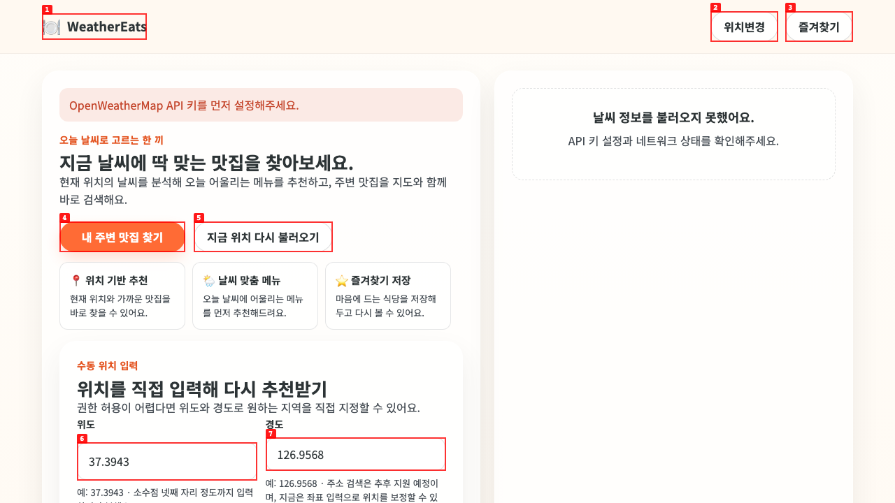
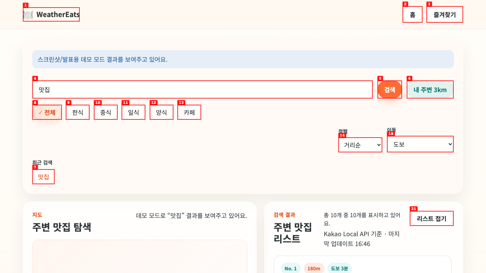
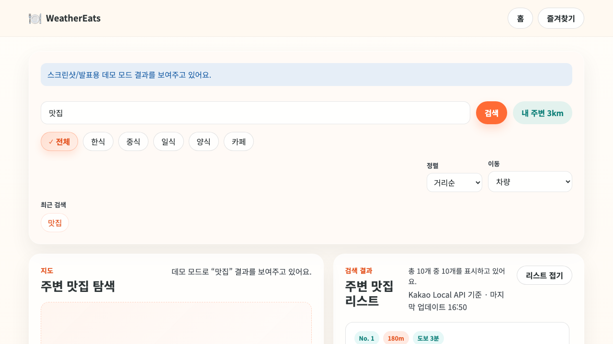
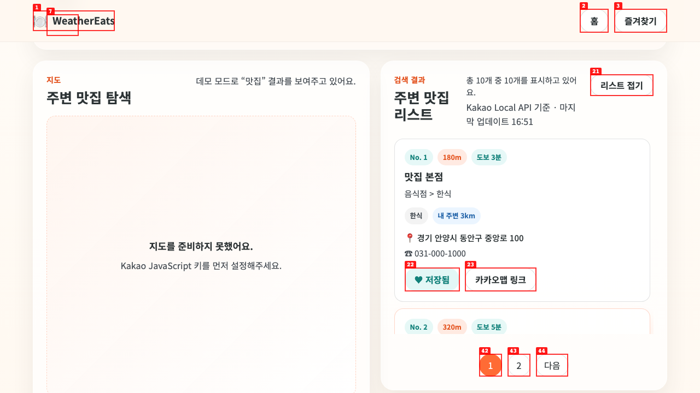
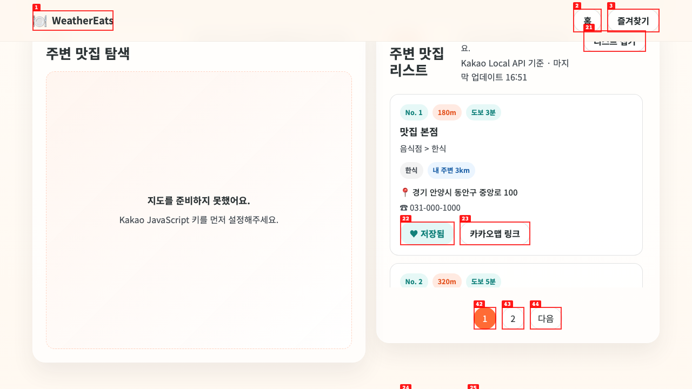
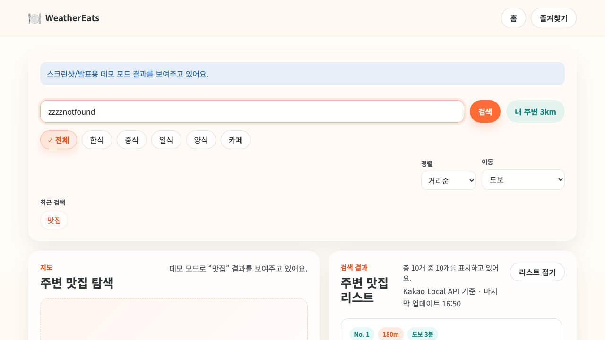
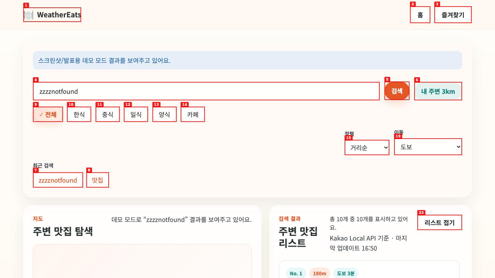

# Dogfood Report: WeatherEats

| Field | Value |
|-------|-------|
| **Date** | 2026-04-01 16:44:43 |
| **App URL** | http://127.0.0.1:4177/index.html |
| **Session** | weathereats-local |
| **Scope** | Full app UI/UX dogfood of landing, search, and favorites pages |

## Summary

| Severity | Count |
|----------|-------|
| Critical | 0 |
| High | 2 |
| Medium | 2 |
| Low | 2 |
| **Total** | **6** |

## Issues

### ISSUE-001: Header brand icon renders as a broken/missing glyph

| Field | Value |
|-------|-------|
| **Severity** | low |
| **Category** | visual / content |
| **URL** | http://127.0.0.1:4177/index.html |
| **Repro Video** | N/A |

**Description**

The top-left WeatherEats brand is intended to show a plate emoji/icon, but on the tested pages it renders like a broken or missing glyph. This weakens branding and looks like a loading error rather than a deliberate brand mark.

**Repro Steps**

1. Navigate to the landing page.
   

2. **Observe:** the icon area to the left of “WeatherEats” looks broken instead of showing a clean food/plate mark.
   

---

### ISSUE-002: Search controls panel has excessive dead space and weak grouping

| Field | Value |
|-------|-------|
| **Severity** | low |
| **Category** | ux |
| **URL** | http://127.0.0.1:4177/search.html?keyword=%EB%A7%9B%EC%A7%91&demo=1 |
| **Repro Video** | N/A |

**Description**

The search controls area leaves a large empty block between the category chips and the “최근 검색” chip, while sort/movement selects float off to the far right. The controls feel visually disconnected, making the search flow harder to scan.

**Repro Steps**

1. Navigate to the search page in demo mode.
   

2. **Observe:** “최근 검색” sits isolated at the lower-left with a large unused area between it and the main controls.
   

---

### ISSUE-003: Changing the movement filter to “차량” does not update ETA labels

| Field | Value |
|-------|-------|
| **Severity** | medium |
| **Category** | functional |
| **URL** | http://127.0.0.1:4177/search.html?keyword=%EB%A7%9B%EC%A7%91&demo=1 |
| **Repro Video** | videos/issue-002-repro.webm |

**Description**

The search UI exposes an “이동” filter with “도보 / 차량”, but selecting “차량” does not change the ETA badges in the result cards. The cards continue to show “도보 N분”, so the control appears non-functional.

**Repro Steps**

1. Navigate to the search page in demo mode.
   

2. Change the “이동” filter from “도보” to “차량”.
   

3. Scroll the results into view.
   

4. **Observe:** result cards still show walking labels such as “도보 3분”, even though “차량” is selected.
   

---

### ISSUE-004: Demo mode still leaves the map pane unusable when Kakao JS key is missing

| Field | Value |
|-------|-------|
| **Severity** | high |
| **Category** | functional / ux |
| **URL** | http://127.0.0.1:4177/search.html?keyword=%EB%A7%9B%EC%A7%91&demo=1 |
| **Repro Video** | N/A |

**Description**

The page explicitly says it is showing demo-mode restaurant results, but the left map pane still fails hard with “Kakao JavaScript 키를 먼저 설정해주세요.” This breaks the advertised “지도 + 리스트” experience in the same state where the app is otherwise trying to provide a demo.

**Repro Steps**

1. Navigate to the search page in demo mode and scroll down to the map/list section.
   

2. **Observe:** the result list is populated, but the map area is unavailable and replaced by a key-setup error.
   

---

### ISSUE-005: Landing page falls into an error-first experience when weather API is unavailable

| Field | Value |
|-------|-------|
| **Severity** | high |
| **Category** | ux / functional |
| **URL** | http://127.0.0.1:4177/index.html |
| **Repro Video** | N/A |

**Description**

When the weather API is not configured, the landing page shows an error banner and an empty weather panel immediately. The core promise of the product—weather-based restaurant recommendation—cannot be experienced, and there is no friendly fallback/demo path to keep the first visit useful.

**Repro Steps**

1. Navigate to the landing page.
   

2. **Observe:** the first screen shows an API key error and an empty weather panel instead of a usable recommendation experience.
   

---

### ISSUE-006: Demo-mode search fabricates result lists even for nonsense keywords

| Field | Value |
|-------|-------|
| **Severity** | medium |
| **Category** | functional / ux |
| **URL** | http://127.0.0.1:4177/search.html?keyword=%EB%A7%9B%EC%A7%91&demo=1 |
| **Repro Video** | videos/issue-003-repro.webm |

**Description**

When a nonsense keyword is entered in demo mode, the page still returns a full restaurant list instead of showing a no-results/empty state. This makes the search experience misleading because it suggests the query matched real nearby restaurants when it did not.

**Repro Steps**

1. Navigate to the search page in demo mode.
   

2. Replace the query with a nonsense keyword (`zzzznotfound`).
   

3. Submit the search.
   

4. **Observe:** the app still shows 10 restaurant results and a full list, rather than a “결과 없음” state.
   

---
